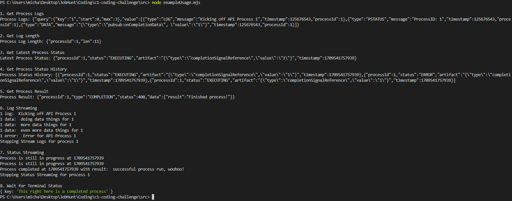

# c1-coding-challenge

I approached the task by first understanding the requirements of my development and the provided API descriptions. I implemented a client library with mock data generators to simulate API responses for the described endpoints. I made assumptions about the structure of the server API responses, especially regarding the format of data and status information. The mock data generators were designed to closely mimic real-world scenarios. In a real API scenario, the client library would use the fetch function to communicate with the server, handling errors and parsing responses appropriately. 

A future extension could of course be to incorporate real asynchronous behavior in place of the mock generators. Another new functionality to add could be a method in the client library, and a new endpoint to fetch specific details of a process. This new method's response could include comprehensive data about the process, such as its start time, end time, execution duration, execution history, associated processes with their statuses, and other relevant details.

Additionally, optimizing the code by exploring potential improvements in handling streaming delays is another area for improvement.

Example Usage Output:

